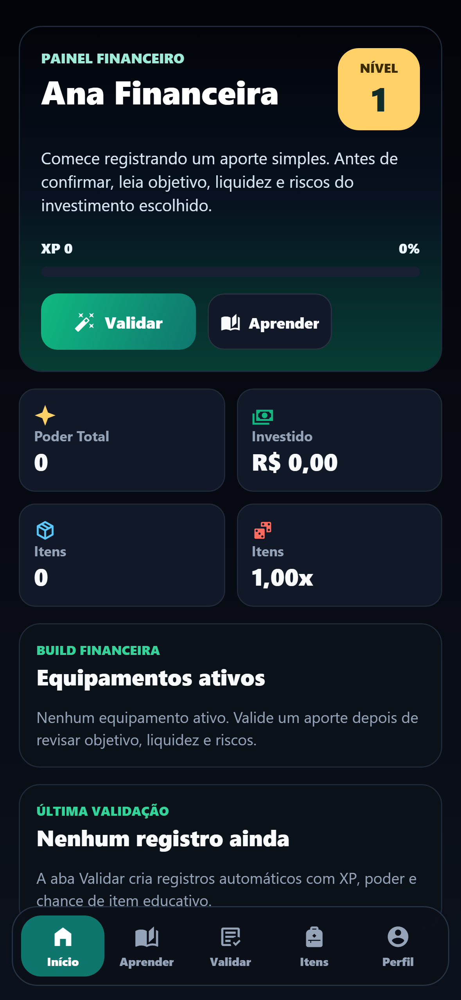
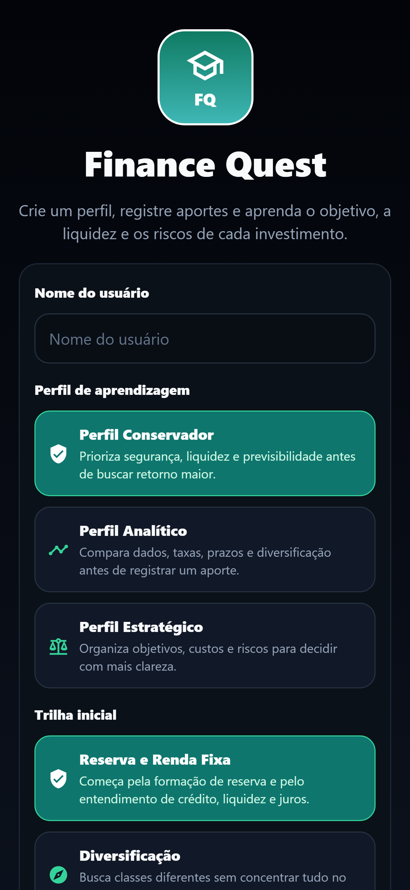
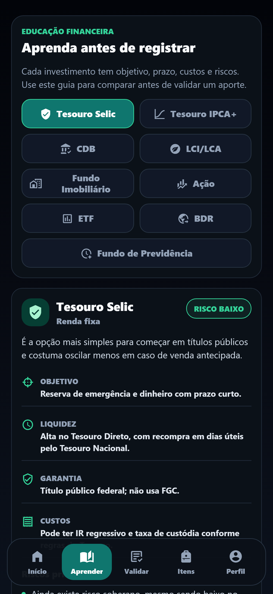
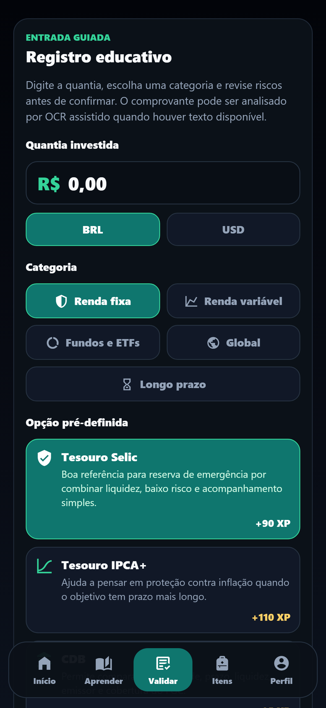
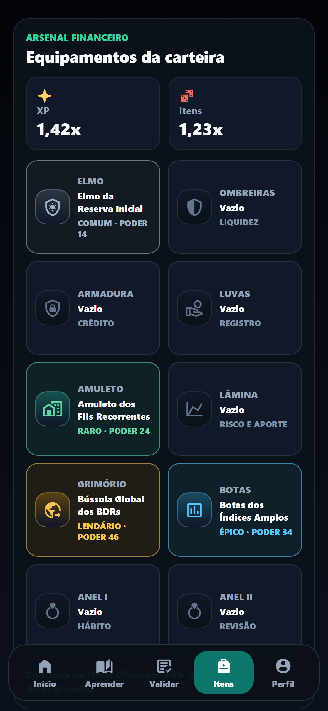
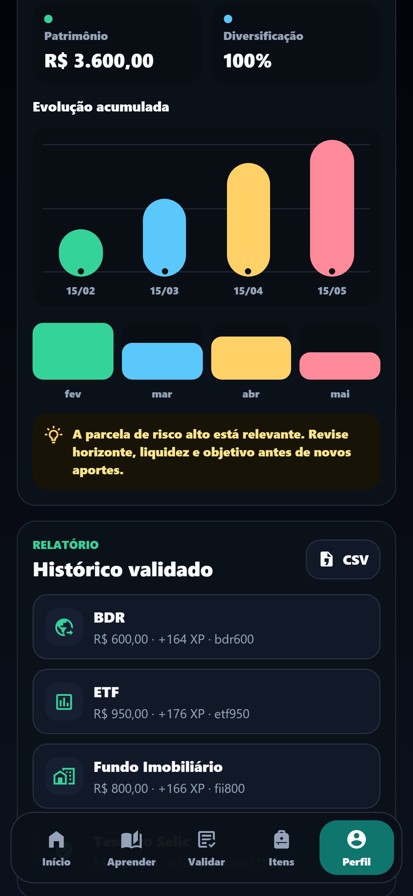

<div align="center">
  <p><a href="./README.en.md">🇺🇸 Read in English</a></p>

  <p><strong>App educacional gamificado para aprender investimentos, organizar aportes e evoluir com missões.</strong></p>

  <p>
  
  
  
  
  </p>
</div>

---

## 🎮 Sobre

**Finance Quest** é um app educacional gamificado que transforma investimentos e organização financeira em uma jornada prática de aprendizado com missões, XP, itens, raridades e sistema de evolução.

O projeto ajuda o usuário a registrar aportes, comparar classes de investimento, revisar riscos e acompanhar a própria evolução financeira com uma experiência mobile inspirada em RPG.

> Conteúdo educativo. O app não recomenda compra, venda ou manutenção de nenhum investimento.

<div align="center">
  
  <br>
  <sub>Painel inicial como ponto de entrada visual da jornada financeira.</sub>
</div>

---

## ✨ Funcionalidades

- Criação de perfil com trilhas de aprendizagem
- Registro educativo de aportes com quantia, moeda, categoria e opção pré-definida
- Guias para Tesouro Selic, Tesouro IPCA+, CDB, LCI/LCA, FII, Ação, ETF, BDR e Previdência
- Explicações sobre objetivo, liquidez, garantia, custos, riscos e checklist antes de investir
- OCR assistido para interpretar textos de comprovantes e sugerir tipo, valor e confiança
- Sistema de XP, nível, poder total, missões e conquistas
- Itens colecionáveis com raridades, equipamentos e multiplicadores
- Arsenal financeiro com elmo, ombreiras, armadura, luvas, amuleto, lâmina, grimório, botas e anéis
- Perfil com gráficos de evolução acumulada, aportes mensais, alocação, risco, concentração e diversificação
- Exportação CSV do histórico validado
- Persistência local no navegador via `localStorage`

---

## 🧱 Tecnologias

<div align="center">


</div>

---

## 📱 Telas

```txt
Mobile
├── Criação de Perfil
├── Início
├── Aprender
├── Validação
├── Itens
└── Perfil
```

---

## 🗂️ Estrutura do Projeto

```txt
financequest/
├── assets/
│   ├── audio/
│   ├── icon.png
│   └── splash-icon.png
├── screenshots/
│   └── mobile/
├── scripts/
│   ├── capture-mobile-screenshots.mjs
│   ├── logic-smoke.mjs
│   └── serve-dist.mjs
├── src/
│   ├── gameData.js
│   ├── mobileApp.js
│   └── mobileGameLogic.js
├── App.js
├── app.json
└── README.md
```

---

## 🚀 Como Começar

Siga os passos abaixo para rodar o projeto localmente.

### 1. Clone o repositório e instale as dependências
```bash
git clone https://github.com/odevfigueiredo/financequest.git
cd financequest
npm install
```

### 2. Rode o app no navegador
```bash
npm run web
```

### 3. Gere uma versão estática
```bash
npx expo export --platform web --output-dir dist-check --clear
npm run preview:dist
```

---

## 🧪 Testes e QA

```bash
npm run test:logic
npm run screenshots:mobile
```

O smoke test cobre parsing de moeda, análise OCR/guiada, guias educativos, drops, equipamentos, níveis, missões, CSV, migração de estado e analytics do perfil.

As capturas mobile são geradas em viewport Android `393x852` com `deviceScaleFactor: 3`, resultando em imagens `1179x2556`.

---

## 📚 Fontes Educativas

As explicações foram organizadas a partir de referências brasileiras e materiais públicos de educação financeira:

- [CVM / Portal do Investidor](https://www.gov.br/investidor/pt-br)
- [ANBIMA Como Investir](https://comoinvestir.anbima.com.br/)
- [Tesouro Direto](https://www.tesourodireto.com.br/)
- [Fundo Garantidor de Créditos](https://www.fgc.org.br/sobre-garantia-fgc)
- [Banco Central - Cidadania Financeira](https://www.bcb.gov.br/cidadaniafinanceira)

---

## 🧭 Próximos Passos (Roadmap)

- Mais missões por perfil de aprendizagem
- Trilhas específicas para reserva, diversificação e longo prazo
- Simuladores educativos de juros, liquidez e risco
- Notificações para revisão periódica da carteira
- Novas conquistas e conjuntos de equipamentos
- Melhorias no OCR e na leitura de comprovantes
- Exportações adicionais além de CSV

---

## 📸 Galeria

### Mobile

<table>
  <tr>
    <td width="33%" align="center">
      
      <br>
      <sub>Criação de perfil</sub>
    </td>
    <td width="33%" align="center">
      
      <br>
      <sub>Início</sub>
    </td>
    <td width="33%" align="center">
      
      <br>
      <sub>Aprender</sub>
    </td>
  </tr>
  <tr>
    <td width="33%" align="center">
      
      <br>
      <sub>Validação</sub>
    </td>
    <td width="33%" align="center">
      
      <br>
      <sub>Itens</sub>
    </td>
    <td width="33%" align="center">
      
      <br>
      <sub>Perfil</sub>
    </td>
  </tr>
</table>

---

<div align="center">

Desenvolvido por [Jonatha Figueiredo](https://github.com/odevfigueiredo)


</div>
